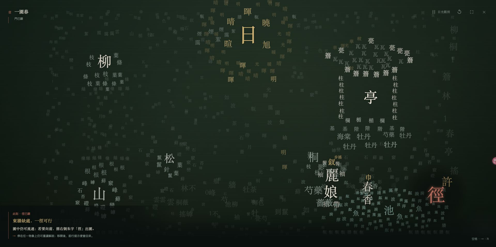
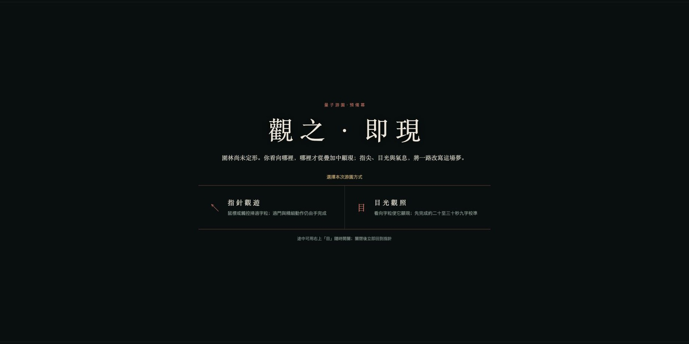
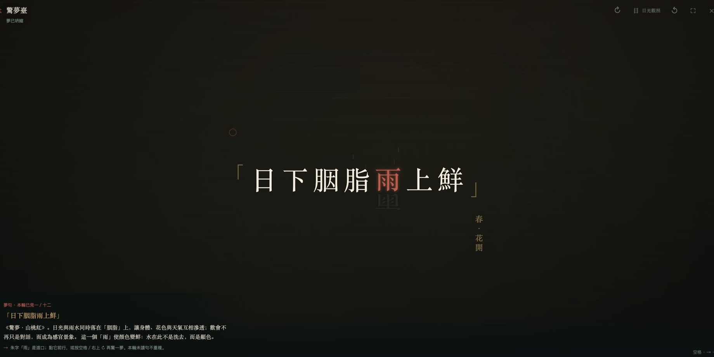
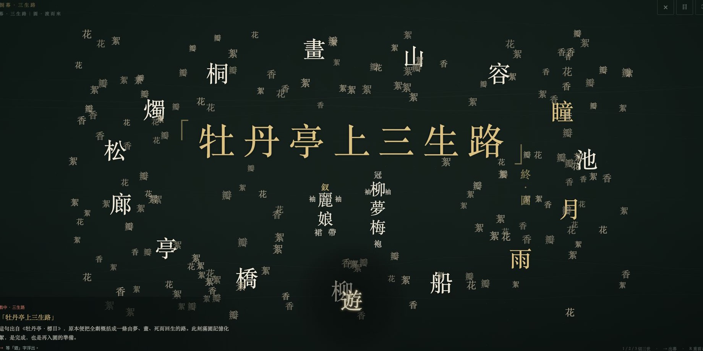
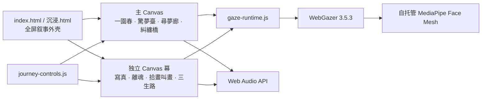

# 量子游园 / Quantum Garden

<div align="center">

《牡丹亭》× 量子观测 × 浏览器交互装置

一次由观看触发的游园：园林未先存在，人物未先定形，结局也不在入口处写好。

[](https://qg-yw6k3p.vercel.app/)


[](LICENSE)

[在线体验](https://qg-yw6k3p.vercel.app/) ·
[八幕调试](https://qg-yw6k3p.vercel.app/%E6%B5%8B%E8%AF%95%E6%80%BB%E8%A7%88.html) ·
[设备检查](https://qg-yw6k3p.vercel.app/?scene=1&setup=1)

</div>



## 作品是什么

《量子游园》是一件八幕浏览器交互作品。它从汤显祖《牡丹亭》的“游园、惊梦、寻梦、写真、离魂、拾画、幽媾、回生”中抽取一条情感路径，再把观测、坍缩、退相干、不可克隆、纠缠与多世界等量子概念转译成观众可以亲自完成的动作。

观众不是在屏幕外阅读一个已经写好的故事。你看向哪里、停留多久、先看见谁、是否吹气、是否继续牵丝，都会改变字的清晰度、人物的出现顺序、幕间出口和最终落定的世界。

这不是量子物理教学模拟器，也不是在古典戏曲表面贴一层科技名词。作品真正关心的是一个共同问题：

> 当“被看见”成为存在的条件，情、记忆与一个人，要怎样才算真的出现？

## 从《牡丹亭》到量子观测

原作中的杜丽娘因春色而醒，因梦而情深，以画像留下自己，又经由柳梦梅的观看与呼唤重新回到人间。《量子游园》将这条路径理解为一连串尚未落定的状态：

| 戏剧经验 | 量子借喻 | 在作品中的交互 |
| --- | --- | --- |
| 初入园林，万物第一次被认真看见 | 叠加态与观测 | 乱字在指针或目光下逐渐凝成真字 |
| 一场梦从无数可能中出现 | 测量坍缩 | 一口气让满屏乱字坍缩为一句诗 |
| 梦醒后重访旧地，却无法复制昨日 | 不确定性 | 园墙可以定住，梦中人始终不能完全凝真 |
| 画像保存形貌，却不能复制生命 | 不可克隆 | 亲手描像仍会碰见无法完成的双瞳 |
| 生命走向衰减，照护只能延缓 | 退相干 | 以荷护烛，亮度仍然只降不升 |
| 一端的呼唤在另一端得到回应 | 纠缠 | 声音、目光和牵丝让两岸关系成立 |
| 同一段情落入不同结局 | 多世界 | 圆、殇、画三条三生路分别落定 |

量子概念在这里是一套叙事语法，而不是对真实量子实验结果的声称。作品当前使用的随机抽句来自浏览器伪随机数，代码中为接入真实量子数据保留了接口。

## 怎样进入这座园



正式体验从预备幕开始。观众先在两种观游方式中选择一种：

- 指针观游：使用鼠标或触控扫过字景。它不需要摄像头，也是所有精细操作的可靠后备方式。
- 目光观照：允许摄像头后，完成约二十至三十秒的九字校准。此后看向字粒即可观测，右上角“目”可随时关闭或重新开启。

作品还会在两个时刻使用声音：

- 驚夢臺：向麦克风吹一口气，使乱字坍缩；拒绝麦克风时可点击画布或按空格。
- 拾畫·叫畫：出声呼唤三次，使画中人回望；无麦克风时可点击画像或按空格。

摄像头和麦克风都不是强制入口。任何权限拒绝都应回落到指针、点击或键盘，不会把观众困在幕间。

## 八幕游园

| 幕 | 戏剧段落 | 观众要做什么 | 这一幕落定什么 |
| --- | --- | --- | --- |
| 壹 · 一園春 | 游园 | 先唤醒麗娘与春香，再随二人走过“日柳山松桐亭池” | 园林沿人物脚步依次凝定，池畔游毕后东墙出现“徑” |
| 貳 · 驚夢臺 | 惊梦 | 对满屏乱字吹气，或点击／按空格 | 一句含水字的梦诗从叠加中坍缩 |
| 參 · 尋夢廊 | 寻梦 | 定住四面园墙，沿廊寻找梦中人 | 地点能够重现，昨日之人却不能被原样复制 |
| 肆 · 寫真 | 写真 | 亲手描出春容，并尝试完成双瞳 | 可见之形与活的对视之间留下不可克隆之墙 |
| 伍 · 離魂 | 闹殇 | 移动荷叶保护长命灯 | 观众能延缓衰减，却不能令生命倒流 |
| 陸 · 拾畫·叫畫 | 拾画／玩真 | 展画、辨认、连续呼唤三声 | 画像从“被观看的对象”变成能够回望的一端 |
| 柒 · 糾纏橋 | 幽媾·回生 | 看见两岸人物，并决定是否牵成纏丝 | 观看顺序与关系是否成立共同生成命途之门 |
| 捌 · 三生路 | 多世界结局 | 在圆、殇、画三世中完成各自不同的观测 | 回生、独梦或留画；随后重新回到一園春 |

正式入口是一条单向叙事。开发和布展阶段可从“八幕调试”逐幕直入，不必重复通关前幕。

## 两次坍缩：诗句与结局



驚夢臺并不把诗句当作静态字幕。吹气前只有尚未落定的字云；坍缩后，句中一个水字转为朱砂，成为下一幕的渡口。同一轮十二句不重复，观众可以反复“再梦”，逐句阅读原文出处、剧情位置和水意解释。

三生路则把整段旅程再坍缩一次。第七幕里“先看见谁、是否牵丝”的结果，决定观众从哪一世进入终幕：

- 圆世：由观众重新接起十五枚共同记忆，完成“牡丹亭上三生路”。
- 殇世：大部分冷字无法转暖，右下只留下唯一可亲手点亮的“梅”。
- 画世：园林与春容自行收入立轴，柳梦梅留在画外观看。



## 随行题跋

左下角不是通关进度条，而是一位随观众移动的讲述者。

当指针或有效目光在一个物象附近稳定停留，题跋会解释它在当前戏剧情境中的位置；机关发生真实变化时，题跋转为事件回执；只有观众需要继续操作、卡住或寻找出口时，它才给出行动提示。

第一幕尤其遵守“不提前知道”的原则。入园先唤醒人物：若先唤麗娘，题跋会请你再找春香；若先唤春香，则反过来请她去找麗娘。二人同醒后，春香领路，麗娘从春日、柳、山、松、桐、亭一路看到池边；观众可以继续观测，也可以完全停手，把这一幕当作一段自动展开的游园小戏。所有题跋只谈她们此刻看见的花木、亭台、池石与春光，不借物象剧透《寻梦》、写真、离魂或回生。

## 输入与快捷操作

| 输入 | 用途 |
| --- | --- |
| 鼠标／触控 | 全部幕的基础观测、选择、牵引和过门 |
| 目光 | 大范围扫视、字粒显真、驻留观测；需要九字校准 |
| 麦克风 | 驚夢臺吹气；拾畫·叫畫的三次呼唤 |
| `Space` | 吹气或呼唤的无麦克风替代；部分幕继续当前动作 |
| `→` | 当前出口已经显现时继续 |
| `R` | 重看本幕 |
| 右上“目” | 随时开启或关闭目光观照 |
| 右上“⛶” | 进入或退出全屏 |
| 右上“×” | 结束本次游园并返回预备幕 |

建议在桌面端 Chrome 或 Edge、横向 16:9 屏幕上体验。目光精度会受到光线、镜头位置、眼镜反光和观看距离影响；精细点击始终保留鼠标与触控。

## 本地运行

摄像头和麦克风要求安全上下文。请使用 `localhost` 或 HTTPS，不要直接通过 `file://` 双击 HTML。

```bash
git clone https://github.com/NovaKepler513/quantum-garden.git
cd quantum-garden
python3 -m http.server 8765
```

打开：

- 正式顺序体验：<http://localhost:8765/>
- 八幕调试总览：<http://localhost:8765/测试总览.html>
- 设备检查：<http://localhost:8765/?scene=1&setup=1>
- 直接测试某幕：`http://localhost:8765/?scene=1` 至 `?scene=8`
- 三生路三结局：`?scene=8&fate=yuan`、`shang`、`hua`

若 `8765` 已被占用，可换成任意空闲端口，并在浏览器中使用相同端口访问。

## 布展与调试

`测试总览.html` 是测试期的逐幕入口；正式体验仍保持单向。设备检查页用于布展者选择摄像头和麦克风、预览画面并测试声音电平，观众不会看到设备清单。

开展前至少完成：

1. 在最终使用的浏览器和屏幕上跑完九字目光校准。
2. 验证摄像头关闭后系统指示灯确实熄灭。
3. 验证驚夢臺能识别吹气，并能在拒绝麦克风后使用点击或空格。
4. 从第一幕走到三生路，检查跨幕全屏没有退出。
5. 分别直入圆、殇、画三世，确认每条路径都能回到一園春。

无头浏览器的 `requestAnimationFrame` 可能只运行少量帧，因此自动截图只能验证构图与静态状态，不能替代真人对连续动画、目光手感、吹气阈值和跨幕全屏的验收。

## 技术结构



项目没有构建步骤、后端服务或框架运行时。主体验由原生 HTML、CSS、JavaScript、Canvas 2D、Web Audio、`getUserMedia` 与 WebGazer 组成。

| 路径 | 职责 |
| --- | --- |
| `index.html` / `沉浸.html` | 维持跨幕全屏、承载预备幕与八幕路由 |
| `量子游园·丙·交互体验.html` | 一園春、驚夢臺、尋夢廊、糾纏橋 |
| `新幕/肆·寫真.html` | 写真与不可克隆交互 |
| `新幕/伍·離魂.html` | 护灯与退相干交互 |
| `新幕/陸·拾畫叫畫.html` | 展画、呼唤与点睛 |
| `新幕/柒·三生路.html` | 圆、殇、画三结局与回环 |
| `gaze-runtime.js` | 跨页目光观测、速度门控、驻留与资源清理 |
| `journey-controls.js` | 全局目光开关、重入、全屏与退出 |
| `webgazer.js` / `mediapipe/` | 自托管的目光估计依赖 |
| `测试总览.html` | 开发与布展阶段的逐幕入口 |

## 隐私

- 摄像头和麦克风只在观众主动选择或触发对应交互后启用。
- 图像、音频电平和目光预测均在浏览器本地处理。
- 项目不包含上传接口、用户账户、广告、行为分析或遥测服务。
- 浏览器可能在本地保存 WebGazer 校准模型；清除该站点数据即可删除。
- 离开页面、关闭目光或结束游园时，程序会停止媒体轨道并清理观测状态。

## 当前状态

项目处于公开预览与持续迭代阶段。八幕叙事、三结局、指针／触控、目光观照、声音交互、测试总览与线上部署均已接通；真实展览环境中的视觉手感、目光校准、吹气阈值、连续动画与跨幕全屏仍必须由真人在目标设备上验收。

问题反馈请附上：

- 浏览器与系统版本
- 屏幕分辨率与缩放比例
- 使用指针还是目光
- 出问题的幕名和操作步骤
- 控制台完整报错与截图

## 文本、开源与致谢

作品文本基于汤显祖《牡丹亭》，引文与场次以公开古籍文本交叉核对；可参看[维基文库《牡丹亭》](https://zh.wikisource.org/wiki/%E7%89%A1%E4%B8%B9%E4%BA%AD)。

项目源代码以 [GPL-3.0](LICENSE) 发布。第三方组件、版本和许可见 [THIRD_PARTY_NOTICES.md](THIRD_PARTY_NOTICES.md) 与 `LICENSES/`。

- 艺术构想、交互设计与视觉方向：胡一葳
- 项目开发与维护：胡一葳、Codex
- 文本原作：汤显祖《牡丹亭》
- 目光估计：WebGazer 3.5.3、MediaPipe Face Mesh

---

### English

*Quantum Garden* is an eight-act browser artwork inspired by Tang Xianzu's *The Peony Pavilion*. Gaze, breath, pointer, touch and voice are treated as acts of observation: they reveal a garden, collapse a field of characters into poetry, slow the loss of coherence, connect two distant figures and finally select one of three worlds.

The work runs entirely in the browser. Camera frames, microphone levels and gaze predictions are processed locally; no backend or analytics service is included.
